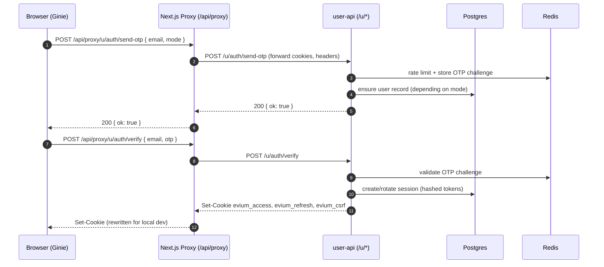
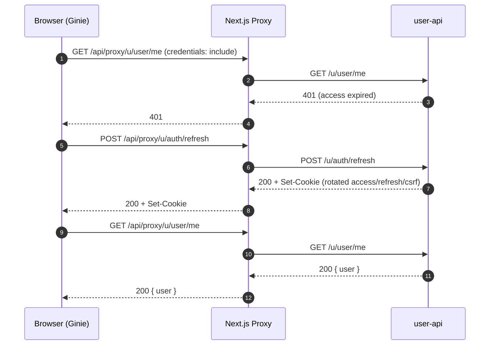
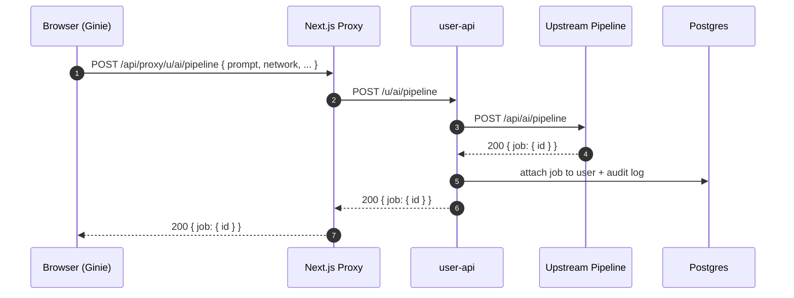
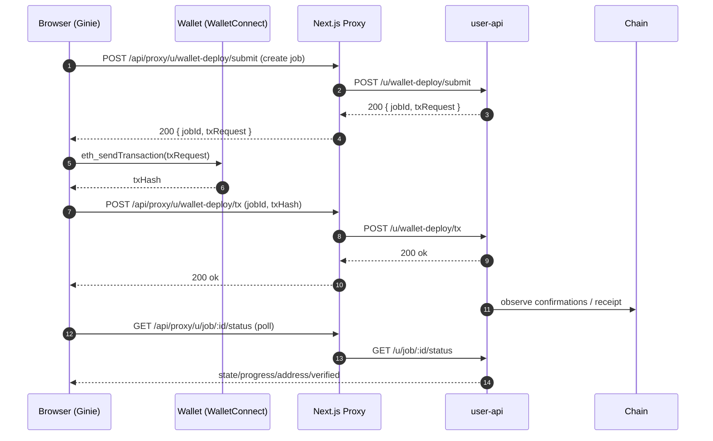

 # Ginie Frontend (BlockXAI)

 Ginie is a Next.js (App Router) frontend for BlockXAI that provides OTP-based authentication, an AI smart-contract / deployment workflow UI, job tracking, artifacts viewing, and wallet connectivity.

 [](https://github.com/BlockXAI/Ginie_Frontend)

 ## Quick Links

 - **Repository**: https://github.com/BlockXAI/Ginie_Frontend
 - **Docs (in this repo)**:
   - `docs/AI_Deployment_API.md`
   - `docs/AI_Deploy_UI_UX_Guide.md`
   - `docs/Technical_Overview.md`

 ## Tech Stack

 - **Framework**: Next.js 15 (App Router)
 - **Language**: TypeScript + React
 - **UI**: TailwindCSS + shadcn/ui (Radix)
 - **Web3**: wagmi + web3modal (WalletConnect)

 ## Local Development

 ### Prerequisites

 - Node.js 20+
 - npm

 ### Install

 ```bash
 npm ci
 ```

 ### Run

 The dev server runs on **port 3100**.

 ```bash
 npm run dev
 ```

 ### Build / Start

 ```bash
 npm run build
 npm run start
 ```

 ## Routing

 Key routes in this app:

 - `/` Home / marketing
 - `/signin` OTP sign-in
 - `/signup` OTP sign-up
 - `/projects` Projects / jobs list
 - `/chat` Chat / pipeline UI
 - `/chat/[id]` Job / chat detail
 - `/profile` Profile (includes wallet connect)
 - `/subscription` Subscription

 Redirects:

 - `/pipeline` redirects to `/smart-contract` (configured in `next.config.js`). If you change the canonical route, update `next.config.js`.

 ## Backend / API Integration

 All browser requests go through the local Next.js proxy route to preserve cookies:

 - **Proxy route**: `app/api/proxy/[...path]/route.ts`
 - **Browser base**: `/api/proxy`

 Server-side / deployment base URL is configured via:

 - `NEXT_PUBLIC_API_BASE_URL`

 If `NEXT_PUBLIC_API_BASE_URL` is not set, the code falls back to the default currently hardcoded in:

 - `lib/api.ts`
 - `app/api/proxy/[...path]/route.ts`

 ## Environment Variables

 Create a `.env.local` in the repo root as needed.

 Common variables:

 - `NEXT_PUBLIC_API_BASE_URL` (optional; upstream user-api base URL used by the proxy)
 - `NEXT_PUBLIC_SITE_URL` (optional; used for sitemap base URL)
 - `NEXT_PUBLIC_BASE_URL` (optional; used in WalletConnect metadata; defaults to `http://localhost:3100`)
 - `NEXT_PUBLIC_WALLETCONNECT_PROJECT_ID` (required for WalletConnect in production)

 ## Web3 / WalletConnect

 Wallet configuration lives in:

 - `lib/web3.ts`

 It uses `NEXT_PUBLIC_WALLETCONNECT_PROJECT_ID` and sets Ginie-branded metadata for wallet prompts.

 ## Documentation

- `docs/wallet-based-deployment/` contains wallet-deployment integration docs.

## Troubleshooting

### Port 3100 already in use

If `npm run dev` fails with `EADDRINUSE: address already in use :::3100`, either:

- Stop the process using port 3100, or
- Change the port in `package.json` scripts (`next dev -p 3100`).

---

## End-to-End System (Ginie + user-api + Frontend_Builder)

This frontend is designed to work with two backend services:

- **User API** (`Evi_User_Management/user-api`)
  - Node.js + TypeScript + Express
  - Owns OTP auth, sessions (cookie-based), entitlements, jobs DB, and acts as a gateway/proxy to upstream services
  - Default local port: `8080`
- **Frontend_Builder** (`Frontend_Builder/`)
  - Python + FastAPI + LangGraph agentic builder
  - Generates frontend apps and can orchestrate a “full DApp” (contract + frontend)
  - Default local port: `8000`

### High-level architecture

```mermaid
flowchart LR
  U[User Browser] -->|HTTP(S) :3100| G[Ginie\nNext.js]

  %% Same-origin proxy so browser cookies work reliably
  G -->|/api/proxy/*| NXP[Next.js Proxy Route\napp/api/proxy/[...path]]
  NXP -->|HTTP(S) :8080| UA[user-api\nExpress]

  %% user-api stores sessions/jobs and rate limits
  UA --> PG[(Postgres)]
  UA --> RD[(Redis)]

  %% user-api proxies to upstream smart-contract pipeline services
  UA --> UP[Upstream Pipeline Service\n/api/ai/pipeline\n/api/job/*\n/api/artifacts/*\n/api/verify/*]
  UP --> CH[(EVM Chains)]

  %% user-api proxies to Frontend_Builder
  UA -->|/u/proxy/builder/*| FB[Frontend_Builder\nFastAPI :8000]
  FB --> FPG[(Frontend_Builder Postgres)]
  FB --> SB[Sandbox / Runner]

  %% service-to-service orchestration
  FB -->|/u/service/*\n(Bearer secret + X-User-Id)| UA
```

### Why the Next.js proxy exists

Ginie uses cookie-based authentication (`evium_access`, `evium_refresh`). Browsers only reliably attach these cookies when requests are **same-origin**.

So in the browser we call:

- `fetch('/api/proxy/u/...', { credentials: 'include' })`

And `app/api/proxy/[...path]/route.ts` forwards cookies + headers to `user-api`.

### Components you’ll touch most

- **Proxy route**: `app/api/proxy/[...path]/route.ts`
- **Central API client**: `lib/api.ts`
- **Route protection**: `middleware.ts`
- **WalletConnect config**: `lib/web3.ts`

---

## Ports & Local URLs

| Service | Default Port | Notes |
|---|---:|---|
| Ginie (Next.js) | `3100` | `npm run dev` uses `next dev -p 3100` |
| user-api (Express) | `8080` | `npm run dev` uses `tsx watch src/index.ts` |
| Frontend_Builder (FastAPI) | `8000` | `start.sh` uses `${PORT:-8000}` |

---

## Environment Variables (quick reference)

### Ginie (this repo)

- `NEXT_PUBLIC_API_BASE_URL`
  - Base URL for `user-api` used by the proxy route in server contexts.
  - Browser calls still go through `/api/proxy`.
- `NEXT_PUBLIC_SITE_URL`
  - Used for metadata + sitemap base.
- `NEXT_PUBLIC_BASE_URL`
  - Used in WalletConnect metadata (defaults to `http://localhost:3100`).
- `NEXT_PUBLIC_WALLETCONNECT_PROJECT_ID`
  - WalletConnect project id used in `lib/web3.ts`.

### user-api (`Evi_User_Management/user-api`)

- `PORT` (default `8080`)
- `APP_URL` / `APP_URLS` (CORS allowlist for the frontend origin)
- `DATABASE_URL`, `REDIS_URL`
- `SESSION_SECRET`
- `OTP_PROVIDER_MODE` (`dev` or `prod`)
- `EVI_BASE_URL` / `EVI_V4_BASE_URL` (upstream pipeline service base)
- `FRONTEND_BUILDER_BASE_URL` (FastAPI base, default `http://localhost:8000`)
- `USERAPI_SERVICE_SECRET` (used for service-to-service auth from Frontend_Builder)

### Frontend_Builder (`Frontend_Builder/`)

- `PORT` (default `8000`)
- `DATABASE_URL`
- `USERAPI_BASE_URL` (base URL for user-api; default `http://localhost:8080`)
- `USERAPI_SERVICE_SECRET` (must match user-api)

---

## Auth Flow (OTP + Cookies + CSRF)

Ginie uses **passwordless OTP** via `user-api`. The backend sets HttpOnly session cookies and a readable CSRF cookie.

### Cookies

- `evium_access` (HttpOnly)
- `evium_refresh` (HttpOnly)
- `evium_csrf` (readable; sent as header `x-csrf-token` on write requests)

### OTP send + verify (sequence)



### CSRF model (why `evium_csrf` exists)

For non-GET routes, `user-api` expects:

- Header: `x-csrf-token: <value>`
- Cookie: `evium_csrf=<value>`

If they mismatch, the backend returns **403**.

`lib/api.ts` is responsible for:

- Reading `evium_csrf` and attaching it as `x-csrf-token`
- Automatically calling refresh once when CSRF is missing/expired

### Refresh + session expiration (sequence)



---

## Pipeline Jobs (Create → Track → Logs → Artifacts)

The smart-contract “pipeline” runs in an upstream service (AI → compile → deploy → verify). `user-api` acts as a gateway:

- Ginie calls `user-api` via `/api/proxy/u/...`
- `user-api` calls upstream `/api/ai/pipeline`, `/api/job/:id/*`, `/api/artifacts/*`
- `user-api` attaches the job to the authenticated user in its DB (`user_jobs`, `job_cache`)

### Create pipeline job (sequence)



### Logs: polling vs streaming (SSE)

There are two common patterns:

- **Polling**: `GET /u/job/:id/logs?offset=...`
- **Streaming**: `GET /u/job/:id/logs/stream` (Server-Sent Events)

When Ginie calls SSE through the Next.js proxy, `app/api/proxy/[...path]/route.ts` preserves the stream by returning `NextResponse(res.body)`.

### Artifacts

After a job completes, Ginie can fetch:

- Sources
- ABIs
- Scripts
- Audit / compliance artifacts (if enabled upstream)

Via `user-api` proxy endpoints (called through `/api/proxy/u/...`).

---

## Wallet-based Deployment (User signs transactions)

Wallet-based deployment is a mode where:

- The pipeline prepares deployment data
- Ginie asks the user’s wallet to sign/broadcast
- The backend tracks tx + job state

Reference docs live here:

- `docs/wallet-based-deployment/`

High-level sequence:



---

## Frontend_Builder Integration

Frontend_Builder is a separate FastAPI service that can generate frontend apps (and optionally orchestrate contract + frontend).

Ginie does **not** talk to Frontend_Builder directly. Instead:

- Ginie calls `user-api` wrapper endpoints under `/u/proxy/builder/*` (through `/api/proxy`)
- `user-api` forwards to `FRONTEND_BUILDER_BASE_URL`

### user-api wrapper routes (important)

These routes are implemented in `Evi_User_Management/user-api/src/index.ts`:

- `POST /u/proxy/builder/projects`
- `GET /u/proxy/builder/projects`
- `GET /u/proxy/builder/projects/:id`
- `PATCH /u/proxy/builder/projects/:id`
- `DELETE /u/proxy/builder/projects/:id`
- `GET /u/proxy/builder/projects/:id/status`
- `GET /u/proxy/builder/projects/:id/files`
- `GET /u/proxy/builder/projects/:id/file?path=...`
- `GET /u/proxy/builder/projects/:id/download` (ZIP stream)
- `POST /u/proxy/builder/projects/:id/export/github`
- `GET /u/proxy/builder/projects/:id/events/stream` (SSE bridge)
- `POST /u/proxy/builder/dapp/create`
- `POST /u/proxy/builder/dapp/frontend-for-contract`
- `GET /u/proxy/builder/projects/:id/contracts`

### Builder events: WS → SSE bridge

Frontend_Builder’s native updates are WebSocket-based (`/ws/{id}?token=JWT`).

To make it easy for Ginie to consume updates through the same-origin proxy, `user-api` exposes:

- `GET /u/proxy/builder/projects/:id/events/stream`

Which bridges events and streams them as SSE to the browser.

### Service-to-service auth (`/u/service/*`)

When Frontend_Builder orchestrates a full DApp, it calls `user-api` service endpoints:

- `POST /u/service/ai/pipeline`
- `GET /u/service/job/:id/status`
- `GET /u/service/artifacts?...`
- `POST /u/service/verify/byJob`

Auth model (implemented in `user-api`):

- Header `Authorization: Bearer <USERAPI_SERVICE_SECRET>`
- Header `X-User-Id: <id>`

This is used by `Frontend_Builder/integrations/userapi_client.py`.
*** End Patch
