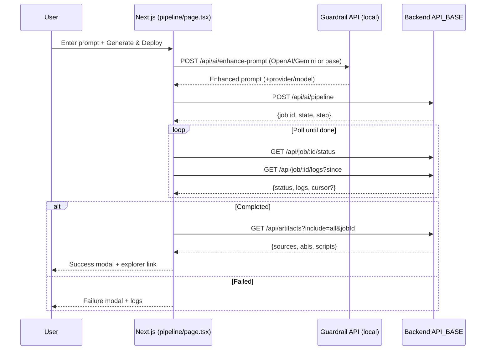

# Camp CodeGen — Technical Overview

This document summarizes the complete repository’s capabilities: features, architecture, API endpoints, data flows, user experience, operational considerations, and value/ROI. It references concrete files/paths for precision.


## Executive Summary
- **What it is**: An AI-assisted platform to generate, compile/fix, and deploy Solidity smart contracts from natural‑language prompts.
- **Key differentiators**:
  - Guardrailed LLM prompt enhancement for deterministic outputs.
  - End‑to‑end pipeline with live logs, progress steps, and full artifacts transparency.
  - Template Library for one‑click prompt bootstrapping.
  - One‑click ERC20 deployment utility.
- **Primary touchpoints**:
  - Frontend page `app/pipeline/page.tsx`
  - Centralized client `lib/api.ts`
  - Guardrail API `app/api/ai/enhance-prompt/route.ts`
  - External backend (configurable) handling pipeline and artifacts


## Tech Stack
- **Framework**: Next.js (App Router)
- **Language**: TypeScript/React
- **UI**: Tailwind CSS, shadcn/Radix UI (e.g., `components/ui/dialog.tsx`, `components/ui/tabs.tsx`)
- **Icons**: `lucide-react`
- **Build/Runtime**: Node.js; serverless-compatible route handlers


## Key Features
- **[AI Prompt Guardrail]** `app/api/ai/enhance-prompt/route.ts`
  - Normalizes freeform prompts into strict, contract‑oriented format (enforces `EMPTY CONSTRUCTOR`, `No constructor args.`, structured functions/events).
  - Multi‑provider enhancement: OpenAI → Gemini → Base guardrail (fallback), with post‑processing normalization.
- **[End‑to‑End Pipeline]** `app/pipeline/page.tsx`
  - Describe → Generate → Compile/Fix → Deploy with live logs and step tracking.
  - Steps: `init`, `generate`, `compile`, `fix`, `deploy` (see `STEP_ORDER` and `bucketizeStep()` in the page).
  - Artifacts viewer: ABI, Sources, Scripts with copy/export.
- **[Template Library]**
  - Horizontal ticker + “View all” modal with search; Copy or Use a template to populate the prompt.
- **[Live Logs (Smart)]**
  - Polling with overlap guard; optional `nextSince` cursor; client‑side dedup within a time window; “×N” repeat indicator; capped list (last 2000).
- **[One‑Click ERC20]**
  - `Api.deployErc20()` to provision a standard token quickly.
- **[UX Polishing]**
  - Steps show `Working` with animated dots (1→2→3) while running.
  - Success/failure modals; copy helpers; explorer links when available.


## Directory & Files (selected)
- **`app/pipeline/page.tsx`**
  - Main page: prompt entry, Templates UI, logs/steps, artifacts, pipeline start button.
- **`lib/api.ts`**
  - Centralized REST client; type definitions.
  - Handles API base resolution via `NEXT_PUBLIC_API_BASE` or default.
- **`app/api/ai/enhance-prompt/route.ts`**
  - Server route for guardrailing + LLM enhancement.
- **Demo/Mock APIs** (for local demo only; not used by the main pipeline):
  - `app/api/generate-contract/route.ts`
  - `app/api/deploy-contract/route.ts`
  - `app/api/job/[jobId]/status/route.ts`
  - `app/api/job/[jobId]/source/route.ts`
- **Docs**
  - `docs/AI_Deployment_API.md` (external backend reference)
  - `docs/Prompt_Enhancement_Guardrail.md` (guardrail route detailed doc)


## API Endpoints

### External Backend (consumed via `lib/api.ts`)
Base is resolved in `lib/api.ts`:
- `NEXT_PUBLIC_API_BASE` if provided; otherwise defaults to `https://acadcodegen-production.up.railway.app`.

Endpoints (see `lib/api.ts`):
- **Run Pipeline**: `POST /api/ai/pipeline`
- **Job Status**: `GET /api/job/{jobId}/status`
- **Job Logs (stream/poll)**: `GET /api/job/{jobId}/logs?since={cursor}`
- **Artifacts (combined)**: `GET /api/artifacts?include=all&jobId={jobId}`
- **Artifacts (by part)**:
  - `GET /api/artifacts/sources?jobId={jobId}`
  - `GET /api/artifacts/abis?jobId={jobId}`
  - `GET /api/artifacts/scripts?jobId={jobId}`
  - `GET /api/job/{jobId}/artifacts` (alternate nesting)
- **AI Helpers (optional)**:
  - `POST /api/ai/generate`
  - `POST /api/ai/fix` (also used by `aiFixEnhanced`)
  - `POST /api/ai/compile`
- **ERC20 Deploy**: `POST /api/deploy/erc20`

Type highlights (from `lib/api.ts`):
- `PipelineRequest`: `{ prompt, network, maxIters?, filename?, constructorArgs? }`
- `PipelineResponse`: `{ ok, job: { id, state, progress, step } }`
- `JobStatusResponse`: `{ ok, data: { id, state, progress, step, result? { network, deployer, contract, fqName, address, params { args } } } }`
- `LogsResponse`: `{ ok, data: { logs: { level: 'info'|'warn'|'error', msg }[] } }`
- `ArtifactsResponse`: `{ ok, data: { sources?, abis?, scripts? } }`
- `ERC20DeployRequest/Response` defined accordingly.

### Local Next.js Routes (in‑repo)
- **Guardrail**: `POST /api/ai/enhance-prompt` (`app/api/ai/enhance-prompt/route.ts`)
  - Uses OpenAI or Gemini (if keys exist), or returns base guardrail.
- **Demo/Mock (do not use for production)**
  - `POST /api/generate-contract`
  - `POST /api/deploy-contract`
  - `GET /api/job/{jobId}/status`
  - `GET /api/job/{jobId}/source`


## Data Flows

### 1) Full Pipeline: Describe → Generate → Compile/Fix → Deploy


### 2) Live Logs: Smart Polling & Dedup (Frontend)
```mermaid
flowchart TD
  A[setInterval fetchLogs] -->|guard| B{fetchingLogsRef?}
  B -- yes --> C[return]
  B -- no --> D[GET /logs?since]
  D --> E[normalize: data.logs, data.nextSince?]
  E --> F[dedupe: map level|message within window]
  F --> G[append or increment repeat]
  G --> H[cap to last 2000]
  H --> I[render ×N if repeat>1]
```


## Frontend UX Details (selected)
- **Steps panel**: `Working` with animated dots (1/2/3) while `job.state === 'running'`.
- **Templates**: Ticker + “View all” modal (searchable), then Copy/Use actions.
- **Artifacts**: Tabs (ABI/Sources/Scripts); Copy JSON/File; Export ZIP.
- **LLM Prompt Debug panel**: Toggle under Templates; shows provider/model, base vs enhanced prompt, copy buttons.
- **Logs**: Autoscroll, color‑coded levels, dedup repeat count.


## Configuration / Environment
- **API Base**: `NEXT_PUBLIC_API_BASE` (default: `https://acadcodegen-production.up.railway.app`).
- **LLM Keys (guardrail route)**:
  - OpenAI: `OPENAI_API_KEY` or `NEXT_OPENAI_API_KEY` (optional `OPENAI_MODEL`)
  - Gemini: `GOOGLE_API_KEY` or `GEMINI_API_KEY` or `GOOGLE_GENERATIVE_AI_API_KEY` (optional `GEMINI_MODEL`)
- **Favicon (App Router)**: `app/icon.png` (auto), legacy `public/favicon.ico` also supported.


## Security & Privacy
- LLM keys are server‑side only in `app/api/ai/enhance-prompt/route.ts`.
- Client talks to local guardrail route (not directly to providers) to avoid exposing keys.
- API client validates HTTP errors and surfaces messages.


## Operational Considerations
- **Logging noise reduction**: Client dedupe collapses repeated lines; supports server cursor `nextSince` (if backend adds it) to remove overlap.
- **Performance**: Log cap (2000) and repeat counters reduce DOM load; polling guarded to avoid concurrent fetches.
- **Resilience**: Guardrail has provider fallback and normalization; artifacts fallback compile can reconstruct ABIs if needed.


## Business Value & ROI
- **Time to deployment**: Reduces developer effort from hours/days to minutes by automating prompt → code → deploy.
- **Quality & determinism**: Guardrail + examples lead to consistent function/event signatures and constructor patterns, reducing rework.
- **Transparency**: Live logs + artifacts build user trust and simplify debugging.
- **Efficiency**: Template Library accelerates common use cases; ERC20 utility removes boilerplate.
- **Ops cost control**: Client dedupe reduces frontend compute/paint; fallback flows avoid hard failures.

Indicative ROI (qualitative):
- **50–80%** reduction in initial development time for simple contracts.
- **30–50%** fewer back‑and‑forth iterations due to prompt guardrails and transparent artifacts.
- **Lower onboarding cost** for non‑Solidity experts via templates and guided UX.


## Roadmap & Improvements
- **Server cursors**: Return `nextSince` for logs in the backend to eliminate any overlap at the source.
- **Message normalization**: Optionally strip volatile suffixes (timestamps/UUIDs) on server for even stronger dedupe.
- **Template taxonomy**: Categories/tags, favorites/pins, and quick‑insert snippets.
- **Access controls**: Per‑org/project permissions to share jobs/artifacts.
- **CI hooks**: Export artifacts into repos; auto‑open PRs with generated code.


## Quick References
- **Main page**: `app/pipeline/page.tsx`
- **Client**: `lib/api.ts`
- **Guardrail**: `app/api/ai/enhance-prompt/route.ts`
- **Docs**: `docs/AI_Deployment_API.md`, `docs/Prompt_Enhancement_Guardrail.md`
- **Demo APIs**: `app/api/*` (mock routes noted above)

